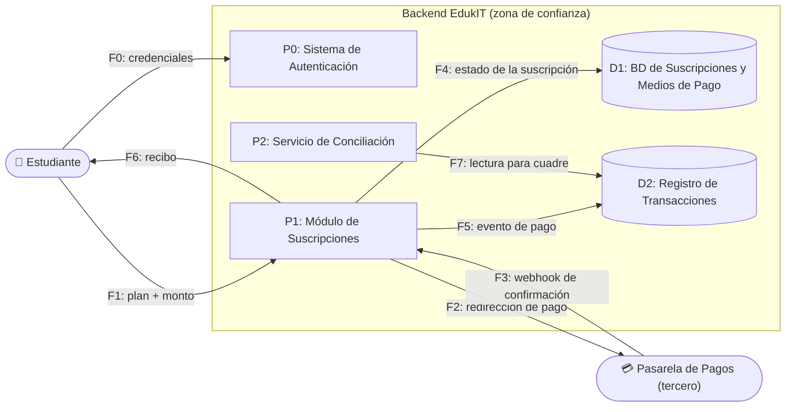

# 🗒️ Registro de Trabajo en Clase - Taller 5: Evaluación de Seguridad con STRIDE

## 📆 Fecha de la sesión

12 de septiembre de 2026

## 👥 Integrantes presentes

- Juan Pablo Luna Zuleta
- Alejandro Riveros
- Martín Ortega

## 🧠 Actividades realizadas en clase

Arrancamos revisando la guía paso a paso y las seis categorías de STRIDE. Lo primero que discutimos fue cuál flujo de EdukIT analizar. El ejemplo de la guía ya trabaja el acceso de estudiantes a cursos, así que decidimos tomar otro de los elementos sensibles del enunciado: **el procesamiento de pagos de suscripción con la pasarela externa**. Nos pareció el más interesante porque es el único flujo del caso base donde el límite de confianza se cruza hacia un tercero que no controlamos, y eso obliga a pensar amenazas que no aparecen en un flujo puramente interno.

Con eso definido dibujamos el DFD en el tablero y después lo pasamos a Mermaid para dejarlo en el repositorio. Identificamos dos procesos internos (módulo de suscripciones y servicio de conciliación), dos almacenes (base de suscripciones y medios de pago, y registro de transacciones), el actor externo estudiante y la pasarela como entidad externa fuera de la zona de confianza. Sobre esos elementos aplicamos las seis categorías una por una.

La discusión más larga fue con el webhook de confirmación de pago. Al principio lo habíamos clasificado como Tampering, porque estábamos pensando en que se modificaba el mensaje. Al revisarlo con el docente quedó claro que si el atacante genera el mensaje desde cero y el servidor no verifica el origen, la amenaza es de suplantación de la pasarela, o sea Spoofing. Esa distinción nos sirvió para las demás filas: Tampering es alterar algo que ya existe, Spoofing es hacerse pasar por alguien.

También nos costó no caer en el error de escribir amenazas genéricas. La primera versión de la fila de denegación de servicio decía "el sistema se puede caer", que no dice nada. La reescribimos apuntando al endpoint concreto y al momento del año en que el impacto es mayor.

**Herramientas usadas:** tablero, Mermaid para el DFD, Excel para la tabla, Docker para levantar Juice Shop en local.

## 🧪 Retos completados en OWASP Juice Shop

Levantamos la instancia con `docker run --rm -p 3000:3000 bkimminich/juice-shop` y abrimos `http://localhost:3000`. Completamos los cuatro retos, no solo el mínimo de uno, y confirmamos cada uno en el tablero de puntajes (`#/score-board`). El nombre entre paréntesis es el del reto tal como aparece en ese tablero.

| Reto | Categoría | Nombre en el score-board | Fila |
|---|---|---|---|
| 1 — Login bypass | Spoofing | Login Admin | T7 |
| 2 — Cantidad negativa | Tampering | Manipulate Basket | T2 |
| 3 — Carrito ajeno | Information Disclosure | View Basket | T4 |
| 4 — Panel de administración | Elevation of Privilege | Admin Section | T6 |

### Cómo hicimos cada uno

**Reto 1 — Login Admin (Spoofing → T7).** En el campo de correo del formulario de inicio de sesión escribimos `' OR 1=1--` y una contraseña cualquiera. La consulta de autenticación concatena el correo sin parametrizar, así que la condición `OR 1=1` la vuelve siempre verdadera y devuelve el primer usuario de la tabla, que es `admin@juice-sh.op`. Entramos con sesión de administrador sin conocer ninguna contraseña.

**Reto 2 — Manipulate Basket (Tampering → T2).** No fuimos por la vía del precio sino por la de la cantidad, que en esta versión es más directa y demuestra el mismo control faltante. Con la sesión abierta, desde la consola del navegador enviamos un `PUT` al recurso del ítem del carrito con un cuerpo `{"quantity":-100}`:

```javascript
fetch('http://localhost:3000/api/BasketItems/1', {
  method: 'PUT',
  headers: { 'Content-Type': 'application/json',
             'Authorization': 'Bearer ' + localStorage.getItem('token') },
  body: '{"quantity":-100}'
}).then(r => r.json()).then(console.log)
```

Al refrescar el carrito la cantidad quedó en −100. El servidor aceptó una cantidad negativa sin validarla, lo que permite dejar el total del carrito por debajo de su valor real. Es el mismo problema de fondo que el reto de precio: el backend confía en un dato que llega del cliente en vez de validarlo o recalcularlo.

**Reto 3 — View Basket (Information Disclosure → T4).** Nuestro carrito era el número 7. Desde la consola consultamos el carrito de otro usuario sin ser su dueño:

```javascript
(await (await fetch('http://localhost:3000/rest/basket/1', {
  headers: { Authorization: 'Bearer ' + localStorage.getItem('token') }
})).json()).data
```

La respuesta trajo el carrito con `UserId: 1`, que no es el nuestro. El servidor entrega cualquier carrito por su identificador sin verificar que pertenezca al usuario autenticado. Es un IDOR clásico: hay autenticación, pero no hay verificación de propiedad del recurso.

**Reto 4 — Admin Section (Elevation of Privilege → T6).** Navegamos directamente a `http://localhost:3000/#/administration`. Cargó el panel de administración completo, con la lista de usuarios registrados (todos sus correos) y el feedback de clientes. El acceso a esa ruta se controla solo en el frontend ocultando el enlace del menú; el backend no revalida el rol al servir los datos.

### Lo que nos quedó del laboratorio

En tres de los cuatro retos el problema no era la autenticación sino la **autorización**: el sistema sabía perfectamente quién éramos y de todas formas nos dejó hacer cosas que no nos correspondían (ver el carrito ajeno, entrar al panel, alterar la cantidad). Eso coincide con que OWASP Top 10:2025 mantenga el control de acceso roto en el primer lugar de la lista, y cambió la forma en que redactamos las mitigaciones: pasaron de "validar" a "revalidar en el servidor en cada solicitud y verificar la propiedad del recurso". Guardamos capturas del panel de administración y del score-board con los cuatro retos en verde como evidencia de la entrega.

## 🧩 Boceto inicial del modelo

DFD del flujo de pagos, tal como quedó después de la sesión:



## 🔁 Tareas definidas para complementar el taller

| Tarea asignada | Responsable | Fecha estimada |
|---|---|---|
| Pasar la tabla de EdukIT al formato de la plantilla oficial y priorizar | Juan Pablo | 07/09 |
| DFD del proceso del cliente real y catálogo de elementos | Martín | 07/09 |
| Reconocimiento pasivo autorizado sobre el dominio institucional | Alejandro | 08/09 |
| Tabla STRIDE del cliente real (10 filas, las 6 categorías) | Los tres | 09/09 |
| Redacción del informe y referencias | Juan Pablo | 13/09 |

## ⚠️ Observaciones para la Parte 2

Quedó claro que no podemos repetir ninguna de las técnicas de Juice Shop contra el sistema del cliente. Para la columna de controles existentes vamos a usar reconocimiento pasivo sobre lo que ya es público, más lo que el cliente nos confirme directamente en reunión, y lo que no alcancemos a verificar lo dejamos marcado como pendiente en vez de inventarlo.

---

_Este documento resume el trabajo colaborativo realizado durante la sesión del Taller 5 en el curso AREM - Universidad de La Sabana._
