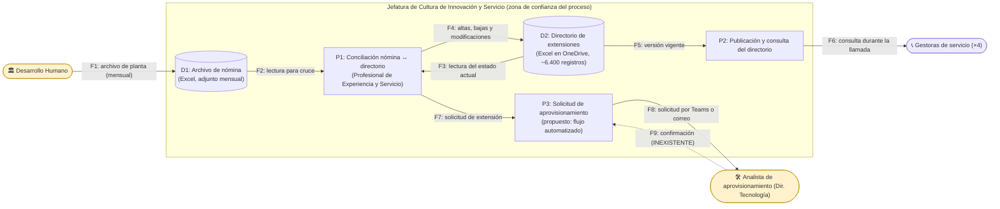

# 📄 Informe Técnico del Taller

## 🔖 Nombre del Taller

_Taller 5 - Evaluación de Seguridad con STRIDE_

## 👥 Integrantes del equipo

- Juan Pablo Luna Zuleta (juanluzu@unisabana.edu.co)
- Alejandro Riveros
- Martín Ortega

## 🧠 Descripción general del trabajo

El objetivo del taller era usar STRIDE para pasar de una intuición vaga sobre "qué podría salir mal" a una lista de amenazas concretas, priorizadas y con una mitigación verificable para cada una. Lo hicimos en dos partes. En clase aplicamos el marco sobre el caso base de EdukIT, tomando el flujo de procesamiento de pagos con la pasarela externa, y complementamos el análisis levantando OWASP Juice Shop en local para ejecutar de verdad cuatro de los ataques que habíamos escrito en el papel. Después trasladamos la metodología al sistema de nuestro cliente real: el proceso de mantenimiento y conciliación del Directorio de Extensiones Telefónicas de la Jefatura de Cultura de Innovación y Servicio de la Universidad de La Sabana.

El resultado son dos tablas STRIDE (una por cada parte), una vista priorizada de los hallazgos del cliente y una hoja con el registro del reconocimiento pasivo que hicimos para no inventar los controles existentes.

Vale la pena decir de entrada que el sistema del cliente no es una aplicación web con endpoints, como sí lo es EdukIT. Es un archivo de Excel de aproximadamente 6.400 registros que vive en OneDrive, se concilia a mano contra la nómina que envía Desarrollo Humano y lo consultan cuatro gestoras de servicio para redirigir llamadas. Esa diferencia terminó siendo lo más interesante del taller y le dedicamos una sección aparte.

## 🔧 Proceso de desarrollo

Seguimos los cinco pasos de la guía sin saltarnos ninguno, porque el primer intento que hicimos —escribir amenazas directamente sobre la lista de elementos sensibles, sin dibujar nada— nos produjo justamente lo que la guía advierte como error frecuente: frases genéricas del tipo "el archivo se puede alterar", que no dicen qué elemento ni cómo ni qué falta para impedirlo.

Con el DFD encima la cosa cambió. Al representar explícitamente de dónde viene el archivo de nómina, quién lo abre, dónde se guarda y quién lo consulta, aparecieron amenazas que no habíamos considerado, sobre todo en el flujo de entrada del archivo desde Desarrollo Humano y en el de solicitud de aprovisionamiento hacia la Dirección de Tecnología. Esos dos flujos cruzan el límite de la unidad y por eso concentran buena parte del riesgo.

Para la columna de controles existentes decidimos no adivinar. Hicimos reconocimiento pasivo sobre lo que ya es público —protocolo y certificado del portal institucional, proveedor de ofimática y correo— y el resto lo dejamos en dos categorías explícitas: lo que ya confirmamos y lo que queda pendiente de verificar con el cliente o de ejecutar antes de la sustentación. Eso está registrado en la hoja `Reconocimiento_Pasivo` del archivo de la entrega. No ejecutamos ninguna prueba activa contra sistemas de la Universidad: los cuatro ataques que sí ejecutamos fueron exclusivamente contra la instancia local de Juice Shop, que existe para eso.

Un punto de método que discutimos bastante: la mayoría de los ejemplos de STRIDE están escritos para aplicaciones con API y base de datos, y nuestro cliente no tiene eso. Nos costó un rato aceptar que un archivo de Excel en OneDrive sí es un almacén de datos en el sentido del DFD, que la profesional que lo edita sí es un proceso, y que una conversación de Teams donde se pide una extensión sí es un flujo de datos. Una vez asumimos eso, el marco funcionó sin forzarlo.

## 🧩 Análisis del modelo propuesto

### Paso 1 — DFD del flujo analizado

Escogimos el proceso de **mantenimiento y conciliación del directorio de extensiones**, que es el proceso que ya veníamos interviniendo en los cortes anteriores y el que origina las fallas del canal telefónico. El límite de confianza que nos importa aquí no es el de "Internet contra la organización" sino el de la unidad frente al resto de la Universidad: Desarrollo Humano y la Dirección de Tecnología son partes legítimas, pero el proceso no tiene forma de verificar lo que recibe de ellas ni de confirmar lo que les pide.

El flujo F9 aparece punteado porque no existe. Ese hueco ya lo habíamos documentado en el Corte 1 como un problema de proceso —los registros quedan indefinidamente en estado "pendiente por aprovisionar", un estado sin transición de salida— y en este taller reaparece con otra cara: como una amenaza de repudio, porque sin confirmación de vuelta ninguna de las dos partes puede demostrar qué se pidió ni cuándo.

### Paso 2 — Elementos analizados

| ID | Elemento | Tipo |
|---|---|---|
| A1 | Desarrollo Humano | Actor externo al proceso |
| A2 | Analista de aprovisionamiento (Dirección de Tecnología) | Actor externo al proceso |
| A3 | Gestoras de servicio (×4) | Actor consumidor |
| P1 | Conciliación nómina ↔ directorio | Proceso (manual) |
| P2 | Publicación y consulta del directorio | Proceso |
| P3 | Solicitud de aprovisionamiento | Proceso (informal hoy; automatizado en la propuesta) |
| D1 | Archivo de nómina | Almacén de datos |
| D2 | Directorio de extensiones | Almacén de datos (activo crítico) |
| F1–F9 | Flujos entre los anteriores | Flujo de datos |

### Pasos 3 y 4 — Amenazas, impacto y mitigación

El detalle completo está en [`tabla-stride-cliente.xlsx`](tabla-stride-cliente.xlsx), hoja `STRIDE_Cliente`: diez amenazas (C1 a C10) con las doce columnas de la plantilla oficial, incluidas escenario de ataque, controles existentes, responsable y estado. Las seis categorías quedaron cubiertas, con dos filas para Spoofing, dos para Repudiation, dos para Information Disclosure, dos para Elevation of Privilege y una para Tampering y Denial of Service respectivamente.

Lo que nos llamó la atención al terminar es que el riesgo del cliente no se concentra en el perímetro técnico —Microsoft 365 resuelve razonablemente bien el cifrado en tránsito, la autenticación con MFA y la disponibilidad del servicio— sino en el **gobierno del dato**: quién puede editar qué, con qué evidencia y con qué posibilidad de reconstruir lo ocurrido. Seis de las diez amenazas no se mitigan comprando nada ni configurando un firewall, sino separando permisos de consulta de permisos de edición y dejando rastro de cada cambio.

La amenaza mejor calificada, C3, ni siquiera necesita un atacante. Un libro de Excel de 6.400 filas editado a mano, sin validación de datos ni bloqueo por columna, se corrompe solo: basta arrastrar una celda de más para desplazar una columna completa, y el error se descubre semanas después cuando las gestoras empiezan a transferir llamadas a la unidad equivocada. Nos pareció importante dejarla como Tampering y no como un simple error operativo, porque el control que falta —integridad del dato en el almacén— es exactamente el mismo en los dos casos.

### Paso 5 — Priorización

La vista ordenada está en la hoja `Priorizacion` del mismo archivo. El bloque de riesgo alto quedó así:

| Prioridad | ID | Tipo STRIDE | Elemento | Nivel de Riesgo |
|---|---|---|---|---|
| 1 | C3 | Tampering | Directorio (D2) / edición manual (F4) | **Alto** |
| 2 | C5 | Information Disclosure | Archivo de nómina (D1) | **Alto** |
| 3 | C8 | Elevation of Privilege | Permisos sobre el directorio (D2) | **Alto** |
| 4 | C4 | Repudiation | Proceso de conciliación (P1) | **Alto** |
| 5 | C10 | Repudiation | Solicitud de aprovisionamiento (F7) | **Alto** |
| 6 | C7 | Denial of Service | Directorio (D2) | **Alto** |

Las seis primeras salieron altas porque su probabilidad es alta o media y ya se materializan hoy con frecuencia observable, no porque el impacto individual sea catastrófico. C3, C4, C8 y C10 tienen probabilidad alta: no son hipótesis, son cosas que el cliente ya nos describió que pasan.

### 🔎 Reconocimiento pasivo autorizado

Registramos lo revisado en la hoja `Reconocimiento_Pasivo`, con una columna de estado de verificación para distinguir lo confirmado de lo pendiente. Lo que quedó verificado a esta fecha es que el portal institucional se sirve sobre HTTPS con certificado válido y que el dominio opera sobre Microsoft 365, lo cual confirma la restricción de espacio de solución que ya habíamos documentado en el Corte 1: cualquier propuesta tiene que caber dentro del tenant, porque instalar software externo exige revisión de comité y por eso el desarrollo de un equipo anterior nunca se desplegó.

Quedan pendientes de ejecutar la revisión de cabeceras de seguridad HTTP, la observación de mensajes de error y la consulta de filtraciones históricas asociadas al dominio. Preferimos entregarlas marcadas como pendientes antes que rellenar la tabla con supuestos, porque una columna de controles existentes inventada vuelve inútil toda la evaluación de riesgo que se construye encima.

Todo lo anterior es observación de lo que el sistema ya expone públicamente. No enviamos credenciales de prueba, no intentamos inyecciones, no accedimos a rutas privadas y no probamos contraseñas.

### 🆚 Diferencias con el caso base

| Dimensión | EdukIT (caso base) | Directorio de Extensiones (cliente real) |
|---|---|---|
| Naturaleza del sistema | Aplicación web a la medida, con API, base de datos y pasarela de pagos | Archivo de Excel en OneDrive más procesos manuales sobre Microsoft 365 |
| Superficie de ataque principal | Endpoints expuestos a Internet | Permisos de compartición, adjuntos de correo y edición manual |
| Atacante típico | Externo, motivado económicamente | Error interno no intencional; el atacante externo es un escenario secundario |
| Categoría dominante | Tampering y Spoofing sobre transacciones | Repudiation y Elevation of Privilege por gobierno del dato |
| Controles disponibles | Código propio: se puede parametrizar consultas, firmar webhooks, revalidar roles | Solo configuración del tenant: etiquetas de Purview, grupos de Entra ID, listas de SharePoint, directivas de Power Platform |
| Costo de la mitigación | Desarrollo | Configuración y cambio de proceso, casi sin costo de licencias |
| Marco normativo que aplica | Ley 1581 de 2012 sobre datos de estudiantes y medios de pago | Ley 1581 de 2012 sobre datos de la planta de personal, con la agravante de que el titular es el propio colaborador |

La diferencia que más cambió nuestro análisis es la del atacante. En EdukIT casi todas las amenazas suponen a alguien que quiere obtener un beneficio, y por eso las mitigaciones son controles técnicos. En el cliente real la amenaza más probable y de mayor riesgo no tiene atacante: es la propia operación manual degradando el dato mes a mes. STRIDE igual sirve, pero hay que leer "amenaza" como pérdida de una propiedad de seguridad y no como acción maliciosa. La integridad se pierde igual si la rompe un atacante o si la rompe un arrastre de celda.

La segunda diferencia relevante es que en el cliente real las mitigaciones no se escriben en código. Cuando la restricción institucional es no instalar software externo, la respuesta a "revalidar permisos en el servidor" se convierte en "definir dos grupos de Entra ID y aplicar menor privilegio sobre una lista de SharePoint". Es el mismo principio con otro instrumento.

### 📌 Supuestos tomados

1. El archivo del directorio se administra desde OneDrive for Business dentro del tenant institucional y no desde una copia local sincronizada como fuente principal. Está por confirmar con el cliente.
2. No sabemos si el archivo se comparte por enlace abierto o por permisos nominales. De esa respuesta depende que C2 baje de riesgo alto a medio, y lo dejamos anotado explícitamente en la tabla.
3. Asumimos que el archivo de nómina contiene nombre, cargo, unidad y correo institucional. Si además incluye documento de identidad o información salarial, C5 sube de nivel y habría que tratarlo como dato de categoría especial.
4. Los controles de plataforma de Microsoft 365 (cifrado en tránsito y en reposo, MFA, historial de versiones) los damos por activos por ser el comportamiento por defecto del servicio, no porque los hayamos verificado uno a uno en el tenant.
5. La automatización con Power Automate todavía no está implementada; C9 es una amenaza sobre el diseño propuesto, no sobre el estado actual. La incluimos a propósito porque es más barato corregirla ahora que después.

### 🧭 Traducción a ArchiMate

Siguiendo la sección 8 de la guía, cada mitigación priorizada es candidata a modelarse como **Requirement** en la capa de Motivación, con una relación de **Influence** hacia el elemento de Aplicación o Tecnología que protege. Así queda el bloque de riesgo alto:

| ID | Requirement (Motivación) | Elemento influido |
|---|---|---|
| C3 | Integridad del dato validada en el origen de captura | Lista de SharePoint del directorio (Aplicación) |
| C5 | Clasificación y protección de datos personales de la planta | Archivo de nómina / Microsoft Purview (Tecnología) |
| C8 | Segregación de permisos de consulta y de edición | Grupos de Entra ID (Tecnología) |
| C4 | Trazabilidad por registro de todo cambio del directorio | Lista de SharePoint del directorio (Aplicación) |
| C10 | Confirmación bidireccional del aprovisionamiento | Flujo de solicitud de extensión (Proceso / Aplicación) |

Esto conecta el taller con el modelo que ya veníamos construyendo: las cinco filas de arriba entran como requisitos en la vista de Motivación sin necesidad de inventar elementos nuevos.

## 📈 Diagrama final entregado

El DFD del flujo analizado está incluido arriba en formato Mermaid y se renderiza directamente en GitHub. El DFD del caso base de EdukIT está en [`../clase/notas.md`](../clase/notas.md).

## 📋 Tabla de actores, entidades o componentes

| Nombre del elemento | Tipo | Descripción | Responsable |
|---|---|---|---|
| Desarrollo Humano | Actor externo | Entrega mensualmente el archivo de planta que sirve de fuente para la conciliación | Dirección de Desarrollo Humano |
| Profesional de Experiencia y Servicio | Actor / Proceso | Administra el directorio y ejecuta la conciliación registro por registro | Jefatura de Cultura de Innovación y Servicio |
| Gestoras de servicio (×4) | Actor consumidor | Consultan el directorio durante la llamada para redirigirla a la unidad competente | Jefatura de Cultura de Innovación y Servicio |
| Analista de aprovisionamiento | Actor externo | Asigna y libera extensiones telefónicas; no confirma de vuelta | Dirección de Tecnología |
| Archivo de nómina (D1) | Almacén de datos | Datos personales de la planta; insumo mensual de la conciliación | Desarrollo Humano |
| Directorio de extensiones (D2) | Almacén de datos | Aproximadamente 6.400 registros; activo crítico del canal telefónico | Jefatura de Cultura de Innovación y Servicio |
| Solicitud de aprovisionamiento (P3) | Proceso | Canal informal por Teams o correo, sin registro estructurado ni confirmación | Ambas unidades |

## 🔍 Investigación complementaria

### Tema investigado

Buenas prácticas y marco normativo de seguridad de la información aplicables al sector de educación superior en Colombia, con foco en la protección de datos personales de la comunidad laboral y en el gobierno de datos maestros que se administran mediante ofimática.

### Resumen

El hallazgo más pertinente para nuestro caso es que en agosto de 2026 la Superintendencia de Industria y Comercio publicó una guía específica sobre el tratamiento de datos personales en el contexto universitario, dirigida a las instituciones de educación superior. La guía se apoya en la Ley 1581 de 2012, sus decretos reglamentarios y la jurisprudencia constitucional, y parte de reconocer que las instituciones administran volúmenes muy grandes de información de aspirantes, estudiantes, egresados, docentes, personal administrativo, familiares y proveedores, incluyendo expedientes académicos, laborales, disciplinarios, financieros y de bienestar. Esto importa directamente para nuestro alcance porque el archivo de nómina que alimenta la conciliación es información laboral de la planta, y el responsable del tratamiento es la Universidad. La guía también recomienda que las instituciones designen un oficial de protección de datos personales encargado de velar por el cumplimiento del régimen, lo que sugiere que la propuesta de gobierno del dato del directorio debería tener un interlocutor formal en esa figura y no quedarse dentro de la unidad.

En el plano técnico usamos tres referencias. La primera es la ISO/IEC 27001:2022 con los controles de la ISO/IEC 27002:2022, que nos dio el vocabulario de los controles que proponemos: clasificación de la información, control de acceso, gestión de identidades, registro de eventos y protección de registros. La segunda es el NIST Cybersecurity Framework 2.0, cuya función *Govern*, incorporada en la versión de 2024, describe justamente lo que le falta a nuestro cliente: no controles adicionales sino responsabilidades definidas sobre quién decide, quién ejecuta y quién responde por el dato. La tercera es la OWASP Top 10:2025, cuya categoría A01 de control de acceso roto sigue en el primer lugar de la lista y coincide con lo que vimos en Juice Shop, donde tres de los cuatro retos que completamos eran fallas de autorización y no de autenticación. Ese mismo patrón se repite en el cliente, donde el problema no es que la gente no esté autenticada —lo está, con MFA institucional— sino que quien puede leer también puede escribir.

La conclusión que sacamos de cruzar las tres fuentes con nuestra tabla es que el trabajo pendiente del cliente es de gobierno, no de tecnología. La plataforma ya trae los controles: Purview para clasificar, Entra ID para segregar, SharePoint para versionar por elemento, Power Platform para acotar conectores. Lo que no existe es la decisión de usarlos ni el rol que responda por ellos. Eso encaja con el diagnóstico que veníamos sosteniendo desde el Corte 1, y le da un argumento normativo adicional a la propuesta: no es solo que la conciliación manual sea ineficiente, es que tratar datos personales de la planta en un archivo sin trazabilidad ni control de acceso diferenciado es difícil de sostener frente al régimen de protección de datos.

## 📚 Referencias

Ver [`referencias.md`](referencias.md) para el listado completo con formato y fechas de consulta.

## ✅ Checklist de autoevaluación

- [x] Se documentó el DFD del flujo analizado, con procesos, almacenes de datos y flujos.
- [x] Se aplicaron las 6 categorías STRIDE sobre los elementos relevantes.
- [x] Cada amenaza está redactada sobre un elemento específico del DFD.
- [x] Cada amenaza tiene una mitigación concreta y verificable.
- [x] Cada amenaza tiene impacto, probabilidad y nivel de riesgo asignado.
- [x] Los hallazgos están priorizados de mayor a menor riesgo.
- [x] Se completaron los cuatro retos de Juice Shop y se relacionaron con las filas T7, T2, T4 y T6.
- [x] La columna de controles existentes distingue lo verificado de lo pendiente y no contiene supuestos disfrazados de hechos.
- [x] No se ejecutó ninguna técnica activa contra sistemas del cliente ni de la Universidad.

---

_Este documento hace parte de la entrega del Taller 5 del curso AREM (Arquitectura Empresarial) - Universidad de La Sabana._
